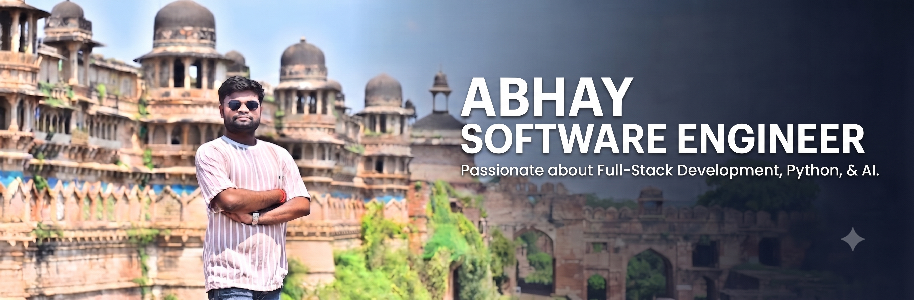

  

<h1 align="center">Hi there, I'm Abhay Sahu 👋</h1>
<h3 align="center">AI Backend Engineer & Machine Learning Developer</h3>

  
  

---

### 🛠️ Tech Stack & Skills

| Category | Technologies |
| :--- | :--- |
| **Languages & Core** |       |
| **Backend & Web** |     |
| **AI, RAG & LLMs** |     |
| **Data Science & ML** |     |
| **Testing & DevOps** |     |
| **Databases & Tools** |     |

---

### 👨‍💻 About Me
* 🌱 I am a student pursuing my **BS in Data Science and Applications** at **IIT Madras** (completed my diploma in May 2026, working toward completing my 4th year in September 2027).
* 💡 Passionate about building robust software systems, machine learning models, and full-stack web applications that solve real-world problems.
* 🚀 Experienced in developing smart project management apps, institutional portals, and predictive data systems.
* 🏆 Active participant in hackathons like the **ISRO Hackathon** and **Compassion-thon** at IIT Madras.

---

### 🚀 Projects & Hackathons
* **Placement Portal Application:** Developed a comprehensive web portal application to streamline student placements and institutional workflows.
* **Smart Library Management Project:** Built an efficient software engineering solution for library tracking, resource management, and user handling.
* **Machine Learning Project (Comment Category Prediction Challenge):** Engineered a predictive machine learning model using robust data preprocessing and classification algorithms.
* **Business Data Management Project:** Designed structured databases and management pipelines for processing and organizing complex business data.

---

### 📊 GitHub Stats & Metrics

 

---

### 📫 Connect With Me

  
  &nbsp;&nbsp;
  

